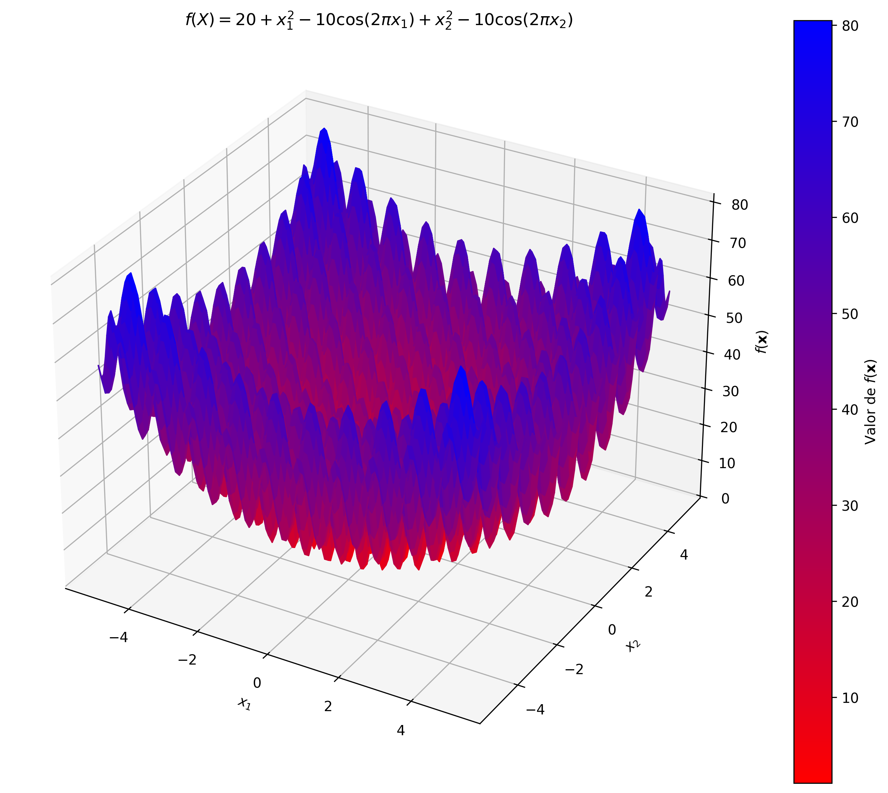

```{r setup, include=FALSE}
knitr::opts_chunk$set(echo = F,
                      warning = F,
                      message = F)
```

\newpage

# Problema 1.

Se desea minimizar la siguiente función


$$f(\vec{x}) = \sum_{i = 1}^D{x_i^2}$$

Donde: 

\begin{itemize}
	\item $D = 10$ representa el número de dimensiones.
	\item $x_i$ puede tomar valores en el rango $[-10,10]$ para $i = 1,2,\dots,D$ 
\end{itemize}

Para representarlo en un espacio de 3D, se fijan 8 de las 10 variables del vector en 0.


\newpage

# Problema 2.

Se desea minimizar la siguiente función

$$f(\vec{x}) = 10D + \sum_{i = 1}^D{(x_i^2 -10\cos(2\pi x_i )) }$$

Donde: 

\begin{itemize}
	\item $D = 10$ representa el número de dimensiones.
	\item $x_i$ puede tomar valores en el rango $[-5.12,5.12]$ para $i = 1,2,\dots,D$ 
\end{itemize}



\newpage

# Problema 1: Representación binaria.

Para representar numero de forma binaria en el intervalo de $[-10,10]$ es necesario considerar almenos 1 bit para el signo, que una parte de la cadena de bits representa la parte entera del numero y otra parte representa la parte decimal del numero.

## Definir el rango de la representación

Para representar los valores reales entre -10 y 10 con una precisión de 3 decimales, es necesario calcular cuantos valores posibles hay ahi:

$$Nposibles = \frac{b-a}{precision} = \frac{20}{0.001} = 20,000$$

## Minimo de bits para representar el número

Ahora, de esos valores, el mínimo de bits para representar esos 20,000 posibles valores se calcula con el logaritmo base 2:

$$nbits = \log_2(20,000) = 14.28 \sim15$$

El mínimo para representar dicha información es con 15 bits.


## Mapear de real a binario

Para hacer el mapeo de un numero $x\in[-10,10]$, es necesario normalizarlo con:

$$u = \frac{x-a}{b-a}$$

Una vez hecho esto, se escala el numero en base 2 por los bits:


$$entero = u\times(2^{2*nbits}-1)$$

\newpage

# Datos del genetico

- Selección por muestreo determinístico
- Cruza uniforme
- Mutaciónm uniforme


