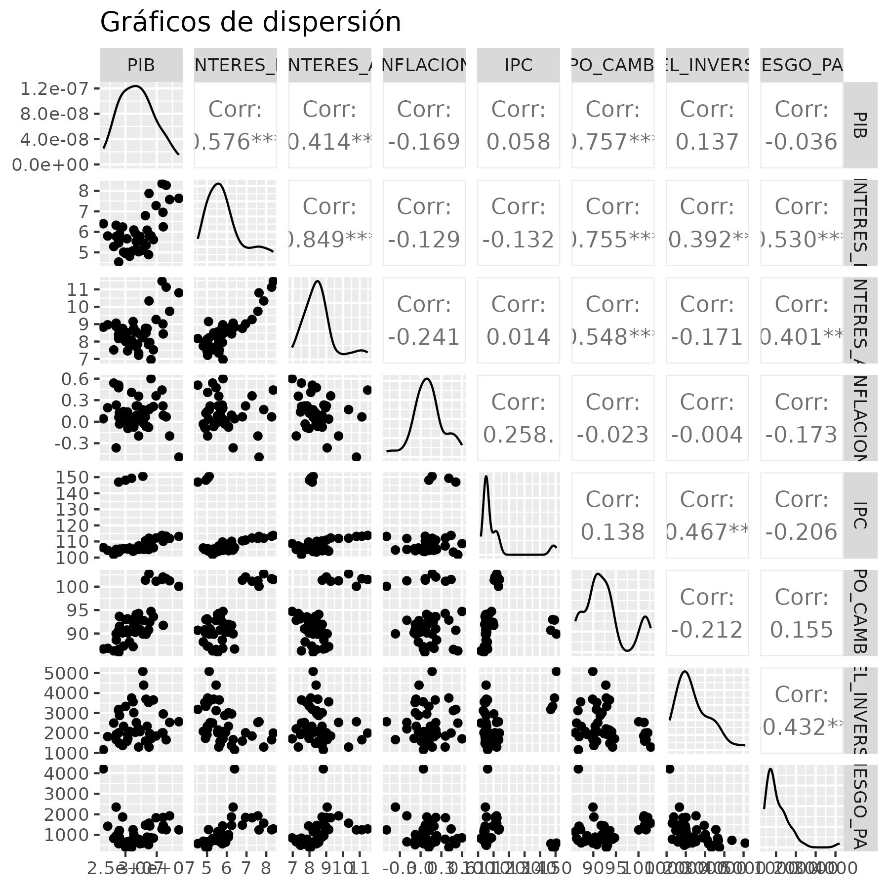

```{r setup, include=FALSE}
knitr::opts_chunk$set(echo = F,
                      warning = F,
                      message = F)
```

\newpage

# Explicación de los datos

Se obtuvieron de diversas fuentes los datos relacionados a la economía nacional de forma trimestral desde el año 2014 hasta el final del año 2024, A continuación se muestra una pequeña muestra de la base de datos.

```{r}
# Cargar las librerias necesarias #
library(flextable)
library(readxl)
library(ggplot2)
library(GGally)
library(MASS) 
library(lmtest)
library(car)

# Cargar tus datos
ruta = "DATA (2).xlsx"
datos = as.data.frame(read_excel(ruta))
# Especial
autofit(theme_box(flextable(head(datos[,1:5]))))
autofit(theme_box(flextable(head(datos[,6:9]))))
```

\newpage

# Exploración de los datos.

A partir de los datos, se obtuvieron las medias, medianas, minimo, maximo, varianza y desviación estandar de cada variable.

```{r}
### Obtener descriptivos
datos1 = datos[,-1]
resu = cbind.data.frame(variables = sub("_"," ",sub("_"," ",names(datos1))),
                 min = apply(datos1,2,min),
                 max = apply(datos1,2,max),
                 media = apply(datos1,2,mean),
                 mediana = apply(datos1,2,median),
                 desviación = apply(datos1,2,sd))
resu[,-1] = round(resu[,-1],4)
# Mostrar
autofit(theme_box(flextable(resu[,c(1,2:5)])))
autofit(theme_box(flextable(resu[,c(1,6)])))
```

\newpage

# Mostra los gráficos de dispersión entre variables 

```{r}
#### Hacer el gráfico de dispersión ####
gr1 = ggpairs(datos1,
              title = "Gráficos de dispersión",
              axisLabels = "show")
ggsave("g1.png",gr1,
       width = 6,
       height = 6,
       dpi = 300)
```



\newpage 

# Modelamiento del modelo para explicar el PIB respecto a todas las variables

Resultados del modelo completo para explicar al PIB 

```{r}
# Modelo completo
modelo = lm(PIB~.,datos1)
# SUMMARY #
theme_box(as_flextable(modelo))
```


\newpage

# Selección del mejor modelo

Mediante el criterio AIC, se determino que el IPC no era significativo para explicar el comportamiento del PIB.

```{r}
#### Selección del modelo ####
modelored = stepAIC(modelo, trace=F, direction="backward")
theme_box(as_flextable(modelored))
```

\newpage

# Validación del modelo   

## Normalidad

Se corrió la prueba de Shapiro-Wilks para probar normalidad:

```{r}
## Prueba de normalidad ##
prueba1 = shapiro.test(modelored$residuals)
theme_box(as_flextable(prueba1)) 
```

Se cumple el supuesto de normalidad con un valor de $p = 0.9474$.

## Homocedasticidad

```{r}
## Prueba de Breush Pagan ##
prueba2 =  bptest(modelored)
theme_box(as_flextable(prueba2)) 
```

Se cumple el supuesto de homocedasticidad con un valor de $p = 0.7025$.

## Independencia

```{r}
## Prueba de independiente ##
theme_box(as_flextable(dwtest(modelored))) 
```

NO se cumple el supuesto de independencia en el modelo, con un valor de $p = 0.0046$.


# Verificar la inflación de la varianza y problemas de multicolinealidad.


```{r}
## Revisar la multicolinealidad ##
A = data.frame(VIFF = vif(modelored))
theme_box(flextable(A))
```

Los valores para el factor de inflaciń de la varianza se encuentran dentro de los valores aceptables.


